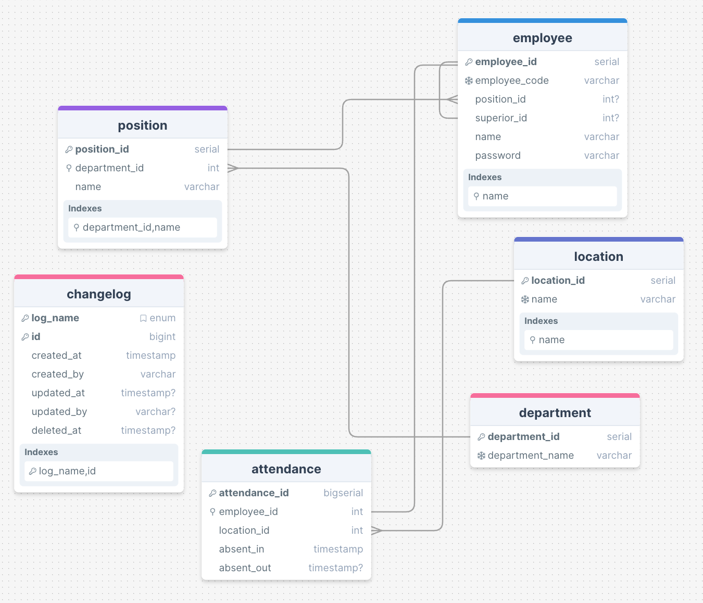

# Swapro Technical Test
---
## Fitur
### Employee (Karyawan)
- **Register**: Mendaftarkan karyawan baru ke dalam sistem.
- **AssignSuperior**: Menetapkan atasan untuk karyawan.
- **GetInformation**: Mendapatkan informasi detail mengenai karyawan.
- **Delete**: Menghapus data karyawan dari sistem.

### Position (Posisi)
- **GetPositionInformation**: Mendapatkan informasi detail tentang posisi tertentu.
- **ApplyToPositionInDepartment**: Mengajukan posisi dalam suatu departemen.
- **ChangePositionName**: Mengubah nama posisi yang ada.
- **DeletePosition**: Menghapus posisi dari sistem.

### Department (Departemen)
- **GetDepartmentInformation**: Mendapatkan informasi detail tentang departemen tertentu.
- **ChangeDepartmentName**: Mengubah nama departemen yang ada.
- **DeleteDepartment**: Menghapus departemen dari sistem.

### Attendance (Kehadiran)
- **CheckInToLocation**: Mencatat kehadiran karyawan di lokasi tertentu.
- **CheckOut**: Mencatat waktu keluar karyawan dari lokasi.
- **GetReportOfAttendances**: Mendapatkan laporan kehadiran karyawan.
- **DeleteAttendances**: Menghapus data kehadiran karyawan.

### Location (Lokasi)
- **GetLocationsEverAttended**: Mendapatkan daftar lokasi yang pernah dikunjungi oleh karyawan.
- **ChangeLocationNameByAttendance**: Mengubah nama lokasi berdasarkan data kehadiran.
- **DeleteLocationByAttendance**: Menghapus data lokasi berdasarkan kehadiran karyawan.

## Skema Database

